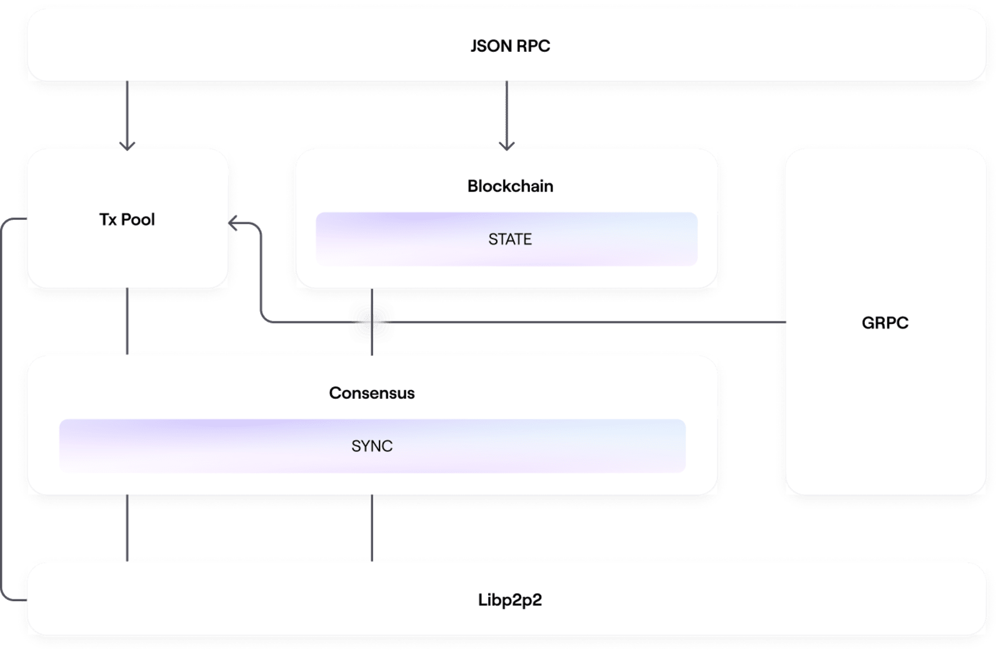

# **Contexto**
El propósito de enlaU es mejorar la vida de los estudiantes y como parte de este propósito mejorar la relación de ellos con el dinero, para ello enlaU conecta jóvenes estudiantes con productos financieros que les permiten ahorrar, gastar, acceder al crédito e incluso invertir. Para lograr este propósito han diseñado un ecosistema descentralizado que permite materializar este cambio a través de UbankU. Ubanku es un neo-banco por que se soporta en un ecosistema descentralizado que conecta todos los servicios que el joven necesita en una sola experiencia de consumo y aprendizaje. El instrumento a través del cual el jóven interactua con el sistema y controla estas interacciones es una SuperWallet o activación digital asociada a una membresía con la cual pueden acceder a los productos digitales a su vez que a los beneficios de la red que se ven representados de diferentes formas comenzando por cashback hasta la asistencia financiera.

La idea de UbankU es descentralizar la actual SuperWallet, soportándo el crecimiento y desarrollo del negocio a través de socios en cada institución universitaria que realizarán la customización de la misma a las necesidades propias del entorno, esto significa conectar la solución con los servicios de la periferia de los campus universitarios y/o explotar los beneficios de ciertos actores representativos de la ciudad en la que se encuentra el nodo. Los aliados con los cuales estos partners locales buscan generar alianzas de negocio proveen alguno de los siguientes:
- Productos y Servicios para mejorar la vida académica de los estudiantes.
- Productos y Servicios para mejorar la calidad de vida y la experiencia de ser estudiante a través de acceso a beneficios en alimentos, gimansios, transporte, tecnología, entretenimiento, etc.
- Ofertas para colaboradores estudiantes o personas que pueden enriquecer el alcance de su oferta de valor como influenciadores, embajadores, líderes de opinión, etc.
  
Para ello UbankU ya ha introducido dentro de sus comunidades el concepto de UCoin. UCoin en su versión inicial es un mecanismo de fidelización e intercambio que sirve entre otros como unidad de medida, medio de cambio, reserva de valor, pero también podría ser visto como mecanismo de generación de valor y activación financiera al permitir el intercambio directo entre cada miembro de la red enlaU si se soporta en tecnologías blockchain que ofrecen transparencia, inmutabilidad, descentralización, oportunidad de acceso y no censura.

# **Abstract**
El propósito de esde RFC es presentar el alcance, los componentes, implicaciones (técnicas y de negocio), riesgos y las algunas alternativas que podrían ser aplicadas en la implementación de un sistema de pagos UCoin que cumple con el propósito de UbankU de acuerdo a lo descrito en el contexto anterior.

# **Motivación**
Actualmente las cominidades universitarias, en particular los estudiantes tienen un nivel de acceso al sistema financiero demasiado restringido debido a los modelos y mecanismos que éste emplea para calificar la confiabilidad de sus participantes generandoles unas barreras de entrada al sistema bastante rígidas. Entre estas barreras econtramos:

1. Los bancos y entidades dedicen quién puede participar basados en estructuras convencionales no pensadas para el mundo de hoy.
2. Estas entidades ofrecen horarios restringidos de funcionamiento y costos inversamente proporcionales a la capacidad de crédito de una persona.
3. Acceso dificil al crédito gracias a modelos de scoring orientados por experiencia laboral, comercial, activos, etc. en donde los estudiantes no pueden puntuar.
4. Exclusión financiera e dificil acceso a mercados internacionales.
5. Acaparamiento de clientes a través de su músculo comercial.

Estos modelos hacen que la entrada al mercado de nuevos competidores sea realmente dificil generando muy bajos niveles de competitividad e innovación. De ahí el auge creciente de las denominadas Fintech que buscan cerrar estas brechas y a acercar de forma incluyente a todas las personas y comunidades no bancarizadas al mundo financiero. Precisamente esto lo que da sustento y alcance a aproximaciones como Nequi, Daviplata y otros sistemas de billetera digital dentro del mundo financiero convencional. Y es que la aparición de estos nuevos servicios y opciones es lo que abre oportunidades para propuestas de valor como la de UbankU al generar un puente que comunica el mundo de las finanzas descentralizadas con el sistema financiero tradicional. 

La motivación principal de este documento es lograr describir con la mayor completitud una solución que permita:
1. Llegar a toda la comunidad estudiantil y darles acceso al mundo financiero sin condiciones distintas a:
   - Pertenecer al mundo estudiantil y 
   - Tener a su alcance un computador o un dispositivo móvil.
2. Eliminar los intermediarios que generan fricción al estudiante en su intento de acceder al mundo financiero.
3. Incrementar la competitividad del mercado al ofrecer disminuir las barreras de entrada a tan solo el uso de una wallet digital
4. Generar oportunidades de intercambio y generación de valor para una gran cantidad de actores pertenecientes a la comunidad. 
5. Generar inclusión financiera y oportunidades de dinamización de la economia.
6. Explotar las oportunidades que ofrece Web3.0.

# **Oportunidad Tecnológica**

Las DeFi (Finanzas Distribuidas) y el desarrollo tecnológico de tecnologías como Blockchain han abierto la puerta al desarrollo de aplicaciones distribuidas (DApps) que permiten a sus usuarios actuar directamente entre ellos y cerrar acuerdos sin la necesidad de que exista una entidad central (como lo propone el sistema tradicional) que defina y controle quién puede o no participar en el sistema o que congele los activos conforme a sus políticas de servicio. En DeFi este tipo de acuerdos son mantenidos y controlados por medio de **Contratos Inteligentes ó Smart Contracts**. 
Los Smart Contract son códigos ejecutables escritos en lenguajes de programación que existen y persisten detro de la red distribuida de blockchain y que se autoejecutan de forma automática y oportuna y que automatizan el cómo de la ejecución del contrato conforme a los lineamiento del qué del contrato. 

Los contratos inteligentes entonces permiten modelar los diferentes tipos de interacciones que pueden ocurrir entre los diferentes actores a través de tokens y rutinas que dan transparencia y visibilidad del mismo en un libro de registro ó libro de órden. 

Por otra parte la evolución de plataformas como Ethereum han permitido la aparición de las denominadas stablecoins con diferentes mecanismos de colaterización o respaldo que les dan solidez y representatividad en el mercado, pero sobre todo abren oportunidades de intercambios sin fronteras, veloces y de alto valor.

# **Visión**

El enfoque y visión de UCoin es convertirse en una Crito moneda que podrá transarse en los mercados Cripto tradicionales siendo una cripto moneda estable (estable coin) que se encuentra en paridad con el dolar americano.  En este sentido UCoin sería la primera criptomoneda estable en latinoamerica diseñada específicamente para la comunidad universitaria que conecta productos, servicios, negocios, entidades financieras y universidades con estudiantes corriendo sobre una red privada descentralizada de blockchain con un modelo de gobiernanza centralizado para darle mas trasparencia, seguridad, alcance y eficiencia a la red y a sus asociados.

Para el montaje de este modelo de descentralización se vinculan a las universidades como validadores de los nuevos bloques (siendo ellos parte del modelo de gobernanza y usando un modelo de validación Proof of Stake) producto de las transacciones que se generen dentro de su nodo y en modalidad de apuesta (stake). En este sentido las universidades terminan siendo también auditores velando por la integridad y seguridad de los fondos que ellas mismas emplearon y usaron como garantía para poder ser validadores. 

# **Características**
## **Generales UCoin**

UCoin funcionará bajo las siguientes características:
1. Sobre la cadena de bloques de *Ethereum*.
2. ***Moneda Green*** que disminuye los costos y gastos energéticos utilizando un modelo de concenso distribuido que garantiza que los particpantes con mayor cantidad verificada de bloques o criptomonedas tengan la posibilidad de encontrar más. 
3. ***Método de Concenso PoS*** para acelerar la velocidad transaccional y garantizar la participación de los nodos miembros de la red. En este sentido cada nodo (Uiversidad/Institución Educativa) se convierte en un validador escalando de manera orgánica en función del tamaño de su apuesta (stake), del tamaño de su comunidad y de la cantidad de trasacciones que se realizan en su interior. 
4. ***Ecalado de Capa 2***. Es una solución de escalado de capa en donde las transacciones y procesos de blockchaoin pueden tener lugar independientemente de la capa 1 (la cadena principal), generando como ventaja usar soluciones fuera de la cadena principal sin generar un cambio estructural pues la capa 2 es agregada como capa adicional. Aquí gran parte de las trasnacciones que pasan por la capa 1 se transladan a la capa 2 en donde se realiza la prueba de concenso. La idea aquí es utilizar Zero Knowledge Rollups (ZK-Rollups). Estos ZK Rollups son smart contracts que escalan la red de Ehereum procesando multiples transferencias fuera de la cadena de blockchain principal y combinandolas en una sola transacción alcanzando un throughput de 2000 TPM (transacciones por segundo). Los Rollups de conocimiento cero retienen fondos en un smart contract y, una vez que se acepta la prueba de validez, las transacciones se confirman y los fondos están disponibles. El conocimiento cero significa que todos los verificadores pueden saber que tienen la misma información, sin que esta se revele.
   
## **Actores**
En el negocio de UBankU partipan diferentes actores cada uno con diferentes alcances:
- *Estudiantes* Representan el core del negocio al hacer dinámico el uso de los UCoins. Un estudiante puede comprar, recibir, enviar y cambiar UCoins a través de su Super Waller. Adicionalmente puede hacer swap de sus UCoins con otras monedas en el mercado Cripto.  
- *Asociados de Negocio (Administración del Nodo)*. Administran y customizan la experiencia de los miembros de la comunidad universitaria que gestionan a través de alianzas con comercios y entidades que proveen servicios a los estudiantes y que construyen la vida universitaria. Pueden dar de alta y gestionar alianzas comerciales con comercios.
- *Comercios en Alianza*. Hacen ofertas y promociones para las comunidades estudiantiles. Están adscritas a un nodo. Gracias a estas alianzas reciben pagos en UCoins a través de una interfaz o tienda digital configurada para sus promociones. 
- *Entidades Financieras*. Proveen servicios de crédito a los miembros de la comunidad a partir del modelo de scoring administrado y gestionado por UbankU. 
- *Pasarelas de Pago*. A través de este mecanismo los miembros de la comunidad pueden apostar por el UCoin haciendo depósitos en sus cuentas. 
- *Exchanges de Cripto*. Están unidos a la red de Ethereum y permiten el intercambio (Swap) de UCoins con otros criptoactivos o incluso NTFs.
- *Administración Central*. Aquí se realiza la administración completa del negocio. Permite la configuración y parametrización de nodos, gestión de recompensas, usuarios, etc.

## **Componentes de la solución**
La solución contempla varios componentes, cada uno con propósitos específicos y para actores concretos.

| Actor      | Componente |
| ----------- | ----------- |
| Estudiante      | [SuperWallet](/SuperWallet/superwallet.md)       |
| Asociados de Negocio   | [BackOffice](Backoffice/backoffice.md)        |
| Comercios en Alianza  | [Administración Micrositio / Tienda Digital](/SiteBuilder/sitebuilder.md)        |
| Entidades Financieras  | Administración Micrositio / Tienda de Servicios Financieros      |
| Pasarelas de Pago  | [Conector de Servicios de Pago](/PaymentGateway/paymentgateway.md)       |
| Exchanges de Cripto  | [Conector de Exchange](/ExchangeConnector/exchangeconnector.md)      |
| Administración Central  | [Backoffice de Admininistración](AdminCentral/admincentral.md)       |
| Nodo Procesamiento  | [Processing Node](/NodoProcesamiento/processingnode.md)       |

## **Casos de Uso**

# **Implementación**
La implementación de UCoin puede llevarse a cabo sobre la red de Polygon (Matic), soportándose en Polygon Edge qué es un framework modular y extensible para la construcción de redes privadas o pública compatibles con Ethereum. 

### **Por qué Polygon Edge?**
- Polygon Edge permite explotar la capacidad de los Smart contracts de Ethereum que proveen compatibilidad con billeteras estándares de la indutria. 
- Permite el desarrollo de un sistema amigable y mantenible de plugins
- Cambiar las funcionalidades core como el método de concenso.
- Provee pugis en tiempo de ejecución que permiten llevar a otro nivel los smart contracts de Ethereum.
- Habilita la cominicaciópn entre diferente blockchains utilizando plugins de puente para integración. Soporta transferencias ERC-20, NFT o encapsulado de monedas nativas.

### **Arquitectura**
La arquitectura de esta alternativa contempla todo el stack de blockchain y está diseñado pensando en la extensibilidad.

#### Componentes
##### Wallet
Este se constituye como el componente central de interacción con el estudiante. Este es un componente clave de éxito.
Ver [Wallet](SuperWallet/superwallet.md)

##### Nodo de Procesamiento
Ver [Nodo de Procesamiento](/NodoProcesamiento/processingnode.md)

##  **Atributos de Calidad**
- **Escalabilidad**. Para resolver el problema de escalabilidad dentro de la plataforma de Polygon se puede utilizar Polygon Zero, una iniciativa que aúnque aún se encuentra en desarrollo, es funcional. Bajo este componente se transalada a una capa de Nodos PolygonZero las trasacciones en batch. Una vez estas son agreadas, polygon zero tranfiere el bloque a la capa 2 en donde se aplica el método de concenso que son agregados en bloques de pruebas que son generados en paralelo para ser enviados finalmente a la capa 1 de Ethereum. El siguiente gráfico muestra el proceso.

- **Usabilidad**. El modelo está en capacidad de emitir tokens directamente colateralizados para realizar operaciones de:
  - Prestamos de diferentes tipos.
  - Pagos
  - Envíos y Recepeciones
  - Intercambio a través de la conexión off-chain ofrecida por la red de Ethereum.
  - Staking, LPL, prestamos P2P.

- **Desempeño**. El módulo de Polygon Zero alcanza a generar hasta pruebas ZK en 170ms con un tamaño de 45kb en modo optimizado. Cada nodo en Polygon Zero es capaz de procesar hasta 100TPS. Un bloque logra crease en 2 segundos con mas de 10 validadores.

# **Desafios/Retos**
- Mantenimiento de la paridad con el dolar. Selección del método de balanceo.
- Conversión moneda local a UCoins. UCoin en cada geografía tienen una equivalencia distinta.
- Legalización Envío / Recepción de UCoins entre nodos de diferente geografía -
- Tasas, Impuestos, Identidad tributaria

# **Métricas**
- Transacciones por Minuto.
- Número de Bloques creados por Nodo. 
- Nivel de staking
- Capitalización de la moneda
- Tiempo medio de txn.
  

# **Riesgos**
- Seguridad. JSON-RPC.
- Reputación 

# **Términos y Conceptos**
### - **Qué es una moneda estable?**
Es una criptomoneda que tiene equivalecia con el valor de una moneda local de un país, por ejemplo en el caso de UCoin, tendrá una partidad con el dóla americano. El propósito de que UCoin se convierta en una stable coin es que:
1. Se pueda transar en exchanges, wallets y mercados descentralizados (DeFi) por fuera de la redes externas a la red de UbankU.
2. Obtener liquidez en otras monedas FIAT a través del intercambio.
3. Lograr disponibilidad en varios Blockchains.
4. Esté protegido de colapsos repentinos o fluctuaciones de los cripto activos.
En este sentido el propósito es sacar el UCoin del panorama de especulación y volverse muy útil para las personas que realizan dia a día operaciones en el mercado creado por UbankU.

### - **Prueba de Trabajo (Proof of Work)**
Proof of Work, o prueba de trabajo, es el método más conocido ya que es utilizado por Bitcoin y Ethereum desde sus comienzos. En este protocolo de consenso, los mineros compiten entre sí en la red para resolver acertijos matemáticos y, aunque son difíciles de encontrar, es fácil verificar la solución correcta. Cuando un minero encuentra la solución, envía un bloque con la solución a la red, y así todos los demás mineros verifican si la solución efectivamente es correcta. Este proceso se repite una y otra vez para que los bloques de la red formen una cadena; de ahí el nombre blockchain.  Además, la primera computadora en hacerlo con éxito es recompensada con una pequeña cantidad de criptomonedas.

La principal ventaja de la PoW es su seguridad ya que como los mineros tienen que destinar muchos recursos a la red, como hardware informático y la electricidad necesaria para alimentarlo, cualquier persona que quiera cometer fraude y/o atacar la red necesitaría obtener más de la mitad de la potencia hash de la red, es decir, tendría que tener una capacidad más grande que el 51% de toda la red para lograr tener la blockchain más larga. A esto se le llama ataque del 51%. Esta es una de las principales características que asegura la red y permite que se realicen transacciones por billones de dólares de valor.

### - **Prueba de Participación (Proof of Stake)**
Una de las mayores diferencias entre PoW y PoS es la utilización de validadores en vez de mineros. Los validadores apuestan una cierta cantidad de la respectiva criptomoneda en la red y, con esto, validan la blockchain.

Desde una perspectiva más técnica, Proof-of-Stake (PoS) es una alternativa al modelo de minería Proof-of-Work (PoW) ya que, en lugar de que los mineros resuelvan acertijos criptográficos utilizando la potencia informática para verificar las transacciones como lo hacen con PoW, los usuarios de PoS utilizan monedas existentes y con estas verifican las transacciones en proporción a la cantidad de monedas que han bloqueado o "enlazado" en una billetera de stacking.

# **Alternativas**
TBD

# **Impacto potencial y Dependencias**
- Polygon Edge
- JSON-RPC 

# **Preguntas sin Resolver**
- Gestión de la liquidez
- Mecanimos de gobernanza
- Tipos de Contratos
- Tokenomics (Gobernanza, Minting (Acuñado), Burning (Quemado))
- Colaterización y respaldo de prestamos.

# **Referencias**

- [Review of Architecture and Components of Ethereum]([https://blogs.sap.com/2020/12/16/review-of-architecture-and-components-of-ethereum/)
- [Mastering Blockchain Programming with Solidity by Jitendra Chittoda](https://www.oreilly.com/library/view/mastering-blockchain-programming/9781839218262/70e4d18e-0f08-446b-9b18-dca71b3f7f1f.xhtml)
- [A Value Token Transfer Protocol (VTTP) for Decentralized Finance](https://www.scirp.org/journal/paperinformation.aspx?paperid=104362)
- [¿Qué son Proof of History, Proof of Work y Proof of Stake?](https://wiki.lemon.me/proof-of-history/)
- [Qué es el problema de escalabilidad en blockchain y por qué es importante?](https://wiki.lemon.me/que-es-el-problema-de-escalabilidad-en-blockchain-y-por-que-es-importante/)
- [Layer-1 (L1) vs Layer-2 (L2): qué son y cómo prometen solucionar la escalabilidad de blockchain?](https://wiki.lemon.me/layer-1-l1-vs-layer-2-l2-que-son-y-como-prometen-solucionar-la-escalabilidad-de-blockchain/)
- [Polygon Docs](https://edge-docs.polygon.technology/docs/)
- [My Journey to Becoming a Validator on Ethereum 2.0](https://consensys.net/blog/blockchain-explained/my-journey-to-becoming-a-validator-on-ethereum-2-0/)
- [Aries RFC 0050: Wallets](https://github.com/hyperledger/aries-rfcs/tree/main/concepts/0050-wallets)
- [Wallets - Indy HIPE](https://docs.google.com/presentation/d/1d35TtEAP-f1tTh88XSZ2uQ2qnuPh6JIPluIWno_P3b0/edit#slide=id.g3a09c83097_2_19)
- [Privacy Preserving Reputation Systems based on
Blockchain and other Cryptographic Building
Blocks: A Survey](https://perso.liris.cnrs.fr/omar.hasan/publications/hasan_2020_pprs.pdf)
- [Diem Developers Documentation](https://developers.diem.com/docs/welcome-to-diem/)
- [En La U - Whitepaper](https://www.enlau.co/whitepaper)
- [Ethereum developer Docs](https://ethereum.org/en/developers/docs/ethereum-stack/)
